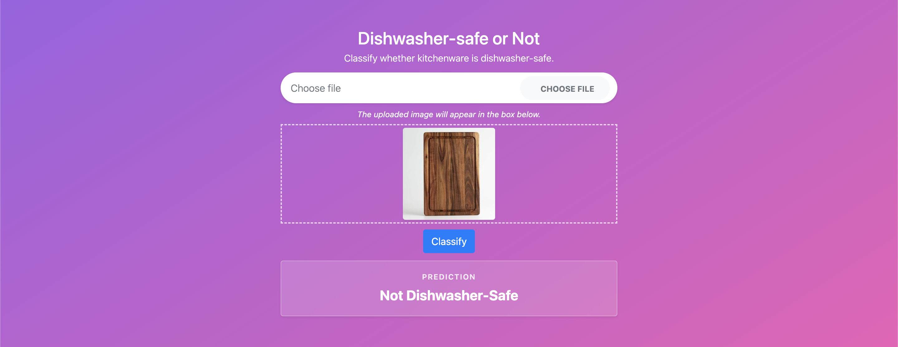
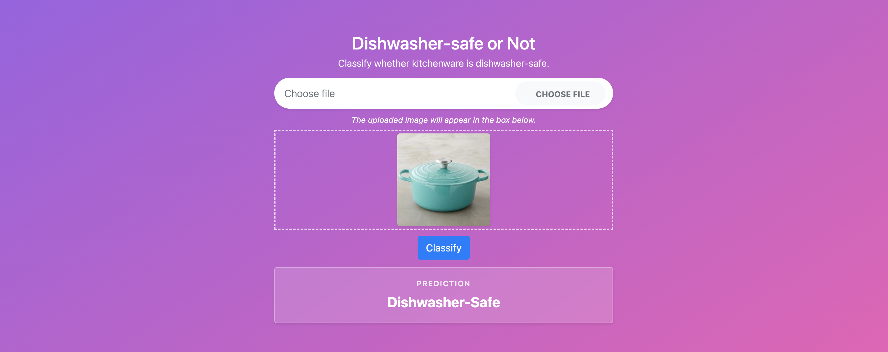

## A Flask web app that predicts whether the kitchenware in the uploaded image is dishwasher-safe or not
### Prerequisites
Place the model classifier trained in this repository: [dishwasher-safe-image-classifier](https://github.com/anushreedas/dishwasher-safe-image-classifier) inside `models/` directory

Make sure the path is correct in the `classify.py` file.

### How to Run
To start the server run the following command:
`flask --app app.py run`

### Output

Reference: [https://geekpython.in/flask-app-for-image-recognition](https://geekpython.in/flask-app-for-image-recognition)

### Author

**Anushree Das**
[LinkedIn](https://linkedin.com/in/anushree-s-das) · [GitHub](https://github.com/anushreedas) · [Medium](https://anushree-das.medium.com/)
